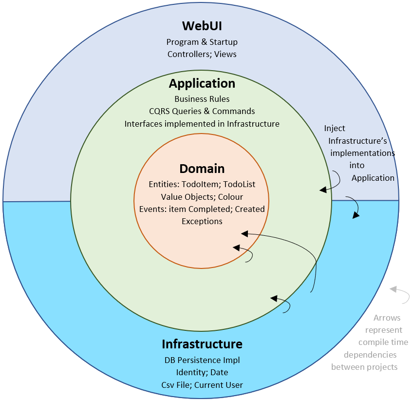
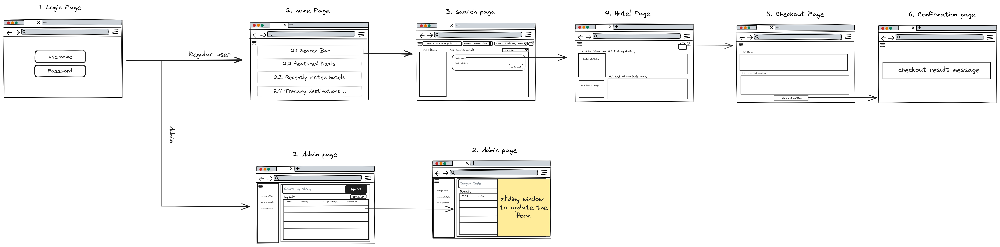
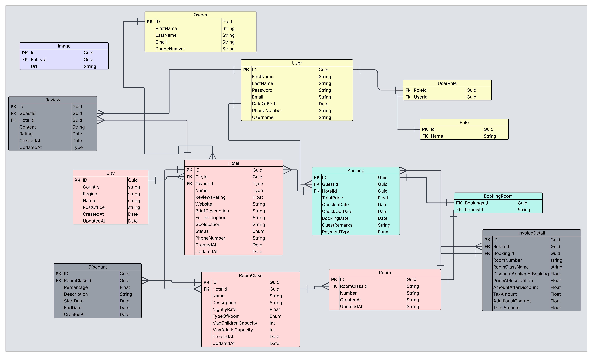

# Travel and Accommodation Booking Platform


[](https://github.com/jafar-sweity/Travel-and-Accommodation-Booking-Platform/actions/workflows/dotnet-ci.yml)
Welcome to the **Travel and Accommodation Booking Platform**, a full-featured travel booking system similar to Booking.com or Expedia. It allows users to search for hotels, book rooms, and receive invoice confirmations via email. Built using **Clean Architecture**, **CQRS**, and modern backend development principles with ASP.NET Core, including user authentication, booking management, city and hotel administration, discounts, reviews, and more.

<div align="center">


## </div>

## Table of Contents

- [ Key Features](#-key-features)
- [ Technology Stack](#-technology-stack)
- [ Unit Testing](#-unit-testing)
- [ API Versioning](#-api-versioning)
- [ Setup Guide](#️-setup-guide)
  - [ Prerequisites](#-prerequisites)
  - [ Installation](#-installation)
  - [ Configuration](#-configuration)
  - [ Running the Application](#️-running-the-application)
- [ Endpoints](#-endpoints)
  - [Authentication](#authentication)
  - [Bookings](#bookings)
  - [Cities](#cities)
  - [Discounts](#discounts)
  - [Hotels](#hotels)
  - [Owners](#owners)
  - [Reviews](#reviews)
  - [Room Classes](#room-classes)
  - [Rooms](#rooms)
  - [User Dashboard](#user-dashboard)
- [ System Architecture](#️-system-architecture)
- [ Database Schema Design](#-database-schema-design)

---

## 🌟 Key Features

- **JWT-Based Authentication**  
  Secure user authentication using JWT tokens with role-based access control for Admins, Guests, and Owners.

- **Hotel Booking System**  
  Users (Guests) can search, filter, and book rooms with real-time availability checks, invoice generation in PDF format, and automatic email confirmation.

- **Hotel Management for Admins**  
  Admins can manage hotels, cities, owners, room classes, discounts, rooms, and reviews.

- **Dynamic Discount System**  
  Apply and manage time-limited or permanent discounts to specific room classes to attract customers.

- **City & Hotel Galleries**  
  Upload and manage gallery images and thumbnails for both hotels and cities.

- **Review & Rating System**  
  Guests can leave reviews and ratings for hotels. Admins can manage this content for quality control.

- **Room Class & Room Inventory Management**  
  Add, update, and delete room classes and individual rooms. Ensure rooms are only bookable when available.

- **User Dashboard**  
  Guests can view a history of their bookings and recently visited hotels.

- **PDF Invoice Generator**  
  Automatically generate a detailed PDF invoice after booking, including pricing, discounts, and tax breakdown.

- **Email Notification System**  
  Integrated email service to send booking confirmations and invoice attachments to guests.

- **Fully Clean Architecture**  
  Built with Clean Architecture principles using MediatR, CQRS, and separation of concerns across layers.

- **AWS S3 Integration**  
  Store images in Amazon S3 for scalability and better asset management.

- **Swagger Integration**  
  Full API documentation and testing interface using Swagger UI.

---

## 🛠 Technology Stack

| **Layer**                | **Technologies**                                             |
| ------------------------ | ------------------------------------------------------------ |
| **Backend Framework**    | ASP.NET Core 8.0                                             |
| **Architecture**         | Clean Architecture, CQRS Pattern, MediatR                    |
| **ORM**                  | Entity Framework Core 9.0                                    |
| **Authentication**       | JWT Bearer Tokens, Role-Based Authorization                  |
| **Validation**           | FluentValidation                                             |
| **Email Service**        | MailKit                                                      |
| **PDF Generation**       | QuestPDF (used to generate invoices and other PDF documents) |
| **Image Storage**        | Amazon S3 Bucket                                             |
| **Object Mapping**       | AutoMapper                                                   |
| **Dependency Injection** | Built-in .NET DI container                                   |
| **API Documentation**    | Swagger                                                      |
| **Logging**              | Serilog                                                      |
| **Testing**              | xUnit, Moq, AutoFixture                                      |

---

## 🗂 API Versioning

This platform follows **URL Segment Versioning** to ensure backward compatibility and support for future API enhancements.

All endpoints are versioned using the URL path (e.g., `/api/v1.0/...`), making it easy to manage and evolve the API without disrupting existing clients.

- **Current Version**: `v1.0`

### 🔍 Example Usage

```
GET /api/v1.0/hotels
```

This design allows consumers of the API to:

- Use a specific version without being affected by breaking changes.
- Easily upgrade to newer versions when ready.

---

## 🧪 Unit Testing

Unit testing is a critical part of this platform to ensure reliability, maintainability, and correctness of the business logic. Two separate test projects are maintained:

### 📂 Test Projects

| **Project**                                               | **Description**                                                          |
| --------------------------------------------------------- | ------------------------------------------------------------------------ |
| `TravelAndAccommodationBookingPlatform.Core.Tests`        | Tests core domain logic like entities, value objects, and business rules |
| `TravelAndAccommodationBookingPlatform.Application.Tests` | Tests application-level logic: CQRS handlers, services, validators, etc. |

---

### ⚙️ Tools & Libraries Used

| **Tool**             | **Purpose**                         |
| -------------------- | ----------------------------------- |
| **xUnit**            | Unit testing framework              |
| **Moq**              | Mocking dependencies                |
| **FluentAssertions** | Readable and fluent test assertions |
| **AutoFixture**      | Auto-generating test data           |

---

### ✅ Application Layer Tests (`.Application.Tests`)

- **CQRS Handlers** (e.g., `CreateBookingCommandHandler`)
- **Services & Business Logic**
- **Validation Logic**
- **Mapping via AutoMapper**

📁 Sample folder structure:

```
/Application.Tests
├── Commands/
│ └── Bookings/
│ └── CreateBookingCommandHandlerTests.cs
├── Queries/
├── Validators/
```

🧪 Sample:

```csharp
[Fact]
public async Task Handle_ShouldReturnBookingResponseDto_WhenRequestIsValid()
{
    var command = new CreateBookingCommand { ... };

    _mockMapper.Setup(m => m.Map<BookingResponseDTO>(It.IsAny<Booking>()))
               .Returns(expectedResponse);

    var result = await _handler.Handle(command, CancellationToken.None);

    result.Should().NotBeNull();
    result.TotalPrice.Should().Be(expectedResponse.TotalPrice);
}
```

Core Layer Tests (.Core.Tests)

- Domain Entities

- Business Rules

- Enums and Value Objects

```
/Core.Tests
├── Entities/
│   └── BookingTests.cs
├── ValueObjects/
├── Enums/
```

▶️ Running Tests

```
dotnet test
```

---

## ⚙️ Setup Guide

This guide helps you set up the Travel and Accommodation Booking Platform locally for development and testing.

### 🔧 Prerequisites

Make sure the following tools and dependencies are installed on your system:

- [.NET 8.0 SDK](https://dotnet.microsoft.com/en-us/download/dotnet/8.0)
- [SQL Server](https://www.microsoft.com/en-us/sql-server/sql-server-downloads) (or you can use Docker)
- AWS credentials (For using S3 for image uploads & EC2 & Auto Scaling Group)

---

### 📥 Installation

1. **Clone the Repository**

```bash
git clone https://github.com/yourusername/TravelAndAccommodationBookingPlatform.git
cd TravelAndAccommodationBookingPlatform
```

2. **Restore .NET Dependencies**

```
dotnet restore
```

3. **Apply Migrations to Initialize the Database**

```
dotnet ef database update --project Infrastructure/TravelAndAccommodationBookingPlatform.Infrastructure.csproj
```

### 🛠 Configuration

```
{
  "ConnectionStrings": {
    "DefaultConnection": "Server=YOUR_SERVER;Database=BookingPlatformDB;Trusted_Connection=True;"
  },
  "JwtSettings": {
    "Secret": "YourSuperSecretKey",
    "Issuer": "YourIssuer",
    "Audience": "YourAudience",
    "ExpirationMinutes": 60
  },
  "AWS": {
    "AccessKey": "your-access-key",
    "SecretKey": "your-secret-key",
    "BucketName": "your-bucket-name",
    "Region": "us-east-1"
  },
  "EmailSettings": {
    "SmtpServer": "smtp.example.com",
    "Port": 587,
    "Username": "your-email@example.com",
    "Password": "your-email-password"
  },
  "Logging": {
    "LogLevel": {
      "Default": "Information",
      "Microsoft.AspNetCore": "Warning"
    }
  },
  "AllowedHosts": "*"
}
```

### ▶️ Running the Application

1. **Navigate to the WebAPI Project:**

```
cd WebAPI
dotnet run
https://localhost:5001 or http://localhost:5000
Swagger UI: https://localhost:5001/swagger

```

---

## 🔗 Endpoints

This section outlines the available REST API endpoints grouped by functionality. All endpoints follow RESTful principles and are secured via JWT authentication where needed.

---

### 🔐 Authentication

Handles user authentication and account registration.

| **Endpoint**                         | **Method** | **Description**                          | **Authentication Required** |
| ------------------------------------ | ---------- | ---------------------------------------- | --------------------------- |
| `/api/authentication/login`          | `POST`     | Authenticate a user and return JWT token | ❌ No                       |
| `/api/authentication/register-guest` | `POST`     | Register a new guest user                | ❌ No                       |

---

### 📅 Bookings

Manages booking-related operations for users.

| **Endpoint**                      | **Method** | **Description**                         | **Authentication Required** |
| --------------------------------- | ---------- | --------------------------------------- | --------------------------- |
| `/api/user/bookings`              | `GET`      | Get a paginated list of user bookings   | ✅ Yes                      |
| `/api/user/bookings/{id}`         | `GET`      | Get details of a specific booking by ID | ✅ Yes                      |
| `/api/user/bookings`              | `POST`     | Create a new booking                    | ✅ Yes                      |
| `/api/user/bookings/{id}`         | `DELETE`   | Delete a booking by ID                  | ✅ Yes                      |
| `/api/user/bookings/{id}/invoice` | `GET`      | Get booking invoice PDF                 | ✅ Yes                      |

---

### 🏙 Cities

Manages city-related operations.

| **Endpoint**                 | **Method** | **Description**                             | **Authentication Required** |
| ---------------------------- | ---------- | ------------------------------------------- | --------------------------- |
| `/api/cities/trending`       | `GET`      | Retrieve list of trending cities            | ❌ No                       |
| `/api/cities`                | `GET`      | Get paginated list of cities for management | ✅ Yes                      |
| `/api/cities`                | `POST`     | Create a new city                           | ✅ Yes                      |
| `/api/cities/{id}/thumbnail` | `PUT`      | Add or update city thumbnail image          | ✅ Yes                      |
| `/api/cities/{id}`           | `PUT`      | Update existing city                        | ✅ Yes                      |
| `/api/cities/{id}`           | `DELETE`   | Delete a city                               | ✅ Yes                      |

---

### 💸 Discounts

Manages discounts for room classes.

| **Endpoint**                                     | **Method** | **Description**                 | **Authentication Required** |
| ------------------------------------------------ | ---------- | ------------------------------- | --------------------------- |
| `/api/room-classes/{roomClassId}/discounts/{id}` | `GET`      | Get discount details by ID      | ✅ Yes                      |
| `/api/room-classes/{roomClassId}/discounts`      | `GET`      | Get paginated list of discounts | ✅ Yes                      |
| `/api/room-classes/{roomClassId}/discounts`      | `POST`     | Create a new discount           | ✅ Yes                      |
| `/api/room-classes/{roomClassId}/discounts/{id}` | `DELETE`   | Delete a discount               | ✅ Yes                      |

---

### 🏨 Hotels

Manages hotel-related operations.

| **Endpoint**                    | **Method** | **Description**                      | **Authentication Required** |
| ------------------------------- | ---------- | ------------------------------------ | --------------------------- |
| `/api/hotels`                   | `GET`      | Get paginated list of hotels (admin) | ✅ Yes                      |
| `/api/hotels/{id}`              | `GET`      | Get hotel details for guests         | ❌ No                       |
| `/api/hotels/featured-deals`    | `GET`      | Get featured deals for hotels        | ❌ No                       |
| `/api/hotels/search`            | `GET`      | Search and filter hotels             | ❌ No                       |
| `/api/hotels/{id}/room-classes` | `GET`      | Get room classes by hotel            | ❌ No                       |
| `/api/hotels`                   | `POST`     | Create a new hotel                   | ✅ Yes                      |
| `/api/hotels/{id}/gallery`      | `POST`     | Add an image to hotel gallery        | ✅ Yes                      |
| `/api/hotels/{id}/thumbnail`    | `PUT`      | Set hotel thumbnail                  | ✅ Yes                      |
| `/api/hotels/{id}`              | `PUT`      | Update existing hotel                | ✅ Yes                      |
| `/api/hotels/{id}`              | `DELETE`   | Delete a hotel                       | ✅ Yes                      |

---

### 👥 Owners

Manages hotel owners.

| **Endpoint**       | **Method** | **Description**              | **Authentication Required** |
| ------------------ | ---------- | ---------------------------- | --------------------------- |
| `/api/owners/{id}` | `GET`      | Get owner details by ID      | ✅ Yes                      |
| `/api/owners`      | `GET`      | Get paginated list of owners | ✅ Yes                      |
| `/api/owners`      | `POST`     | Create a new owner           | ✅ Yes                      |
| `/api/owners/{id}` | `PUT`      | Update existing owner        | ✅ Yes                      |

---

### 📝 Reviews

Manage reviews for hotels.

| **Endpoint**                         | **Method** | **Description**               | **Authentication Required** |
| ------------------------------------ | ---------- | ----------------------------- | --------------------------- |
| `/api/hotels/{hotelId}/reviews/{id}` | `GET`      | Get a specific review by ID   | ❌ No                       |
| `/api/hotels/{hotelId}/reviews`      | `GET`      | Get paginated list of reviews | ❌ No                       |
| `/api/hotels/{hotelId}/reviews`      | `POST`     | Create a new review           | ✅ Yes                      |
| `/api/hotels/{hotelId}/reviews/{id}` | `PUT`      | Update existing review        | ✅ Yes                      |
| `/api/hotels/{hotelId}/reviews/{id}` | `DELETE`   | Delete a review               | ✅ Yes                      |

---

### 🛏 Room Classes

Manage room classes in hotels.

| **Endpoint**                     | **Method** | **Description**                    | **Authentication Required** |
| -------------------------------- | ---------- | ---------------------------------- | --------------------------- |
| `/api/room-classes`              | `GET`      | Get paginated list of room classes | ✅ Yes                      |
| `/api/room-classes`              | `POST`     | Create a new room class            | ✅ Yes                      |
| `/api/room-classes/{id}/gallery` | `POST`     | Add an image to room class gallery | ✅ Yes                      |
| `/api/room-classes/{id}`         | `PUT`      | Update existing room class         | ✅ Yes                      |
| `/api/room-classes/{id}`         | `DELETE`   | Delete a room class                | ✅ Yes                      |

---

### 🚪 Rooms

Manage individual rooms within room classes.

| **Endpoint**                                           | **Method** | **Description**                     | **Authentication Required** |
| ------------------------------------------------------ | ---------- | ----------------------------------- | --------------------------- |
| `/api/room-classes/{roomClassId}/rooms/availableRooms` | `GET`      | Get available rooms (for guests)    | ❌ No                       |
| `/api/room-classes/{roomClassId}/rooms`                | `GET`      | Get paginated list of rooms (admin) | ✅ Yes                      |
| `/api/room-classes/{roomClassId}/rooms`                | `POST`     | Create a new room                   | ✅ Yes                      |
| `/api/room-classes/{roomClassId}/rooms/{id}`           | `PUT`      | Update an existing room             | ✅ Yes                      |
| `/api/room-classes/{roomClassId}/rooms/{id}`           | `DELETE`   | Delete a room                       | ✅ Yes                      |

---

### 📊 User Dashboard

Provides user-specific data and functionalities.

| **Endpoint**                                  | **Method** | **Description**                             | **Authentication Required** |
| --------------------------------------------- | ---------- | ------------------------------------------- | --------------------------- |
| `/api/user/dashboard/recently-visited-hotels` | `GET`      | Get list of recently visited hotels by user | ✅ Yes                      |

---

## 🏗️ System Architecture

The **Travel and Accommodation Booking Platform** is architected using the **Clean Architecture** approach to ensure modularity, separation of concerns, and maintainability.

We adopted several modern design patterns such as **CQRS**, **MediatR**, and **Dependency Injection**, along with clearly separated layers to build a scalable and testable solution.

### 📌 Overview Diagram



This diagram illustrates the high-level architecture of the platform. Each layer has its own distinct responsibility and does not depend on the infrastructure or external tools directly.

### 🧱 Layered Architecture

#### 🔹 Presentation Layer (`WebAPI`)

- Exposes RESTful endpoints.
- Uses controllers to receive requests and delegate them to the application layer.
- Hosts the Swagger documentation for easy API testing.
- Handles HTTP responses and status codes.

#### 🔹 Application Layer

- Contains all business logic, commands, queries, DTOs, and validators.
- Implements **CQRS** using **MediatR**.
- Uses **FluentValidation** for input validation.
- Uses **AutoMapper** for mapping between domain models and DTOs.
- This layer depends only on the domain (Core) layer and is completely framework-independent.

#### 🔹 Domain Layer (`Core`)

- Defines domain entities such as `User`, `Hotel`, `Booking`, `RoomClass`, etc.
- Contains domain-specific interfaces for repositories and services.
- Defines value objects and enums like `PaymentType`, `HotelStatus`, and `RoomType`.
- Represents the **core business rules** of the application.

#### 🔹 Infrastructure Layer

- Implements interfaces defined in the Domain layer.
- Manages the database access using **Entity Framework Core**.
- Implements external integrations like:
  - **JWT Authentication**
  - **PDF generation using QuestPDF**
  - **Email sending via MailKit**
  - **Image storage using AWS S3**
  - **Logging using Serilog**
- Responsible for setting up dependency injection, seeding, and migrations.

---

### 📦 Project Features Diagram



This diagram highlights the key features implemented in the system, including:

- Role-based authentication (Guest/Admin)
- Booking workflow with invoice PDF
- Hotel and city management
- Room availability and class assignment
- Review and discount modules
- Recently visited hotels dashboard
- Full API versioning and Swagger documentation

---

### 📋 Project Requirements

For a detailed view of all functional and non-functional requirements, refer to:

👉 [`ProjectRequirements.md`](./assets/ProjectRequirements.md)

It includes:

- Use cases
- User roles and actions
- Business rules
- External system assumptions
- Technical constraints and goals

---

### 🔄 Workflow Summary

```text
[ Client ]
   → [ WebAPI Controller ]
      → [ Application Layer (MediatR) ]
         → [ Domain Logic (Core) ]
            → [ Infrastructure Layer (DB, Email, S3) ]
```

---

## 🧩 Database Schema Design

The platform uses a **relational database schema** built with **Entity Framework Core** and follows **normalized** design principles to ensure scalability, maintainability, and performance.

It covers all major entities involved in the travel and accommodation booking lifecycle, such as Users, Hotels, Bookings, Rooms, Discounts, and Reviews.

Here’s a visual overview of the schema:

### 📌 ER Diagram

> 

---

### 🧱 Tables & Relationships Overview

| Entity            | Description                                                                                                 |
| ----------------- | ----------------------------------------------------------------------------------------------------------- |
| **Users**         | Stores user credentials and personal data. Connected to Bookings, Reviews, and Roles.                       |
| **Roles**         | Defines system roles like Admin, User, Owner. Many-to-many relation with Users via `UserRole`.              |
| **UserRole**      | Join table linking Users and Roles (many-to-many).                                                          |
| **Cities**        | Represents geographical locations. One-to-many with Hotels.                                                 |
| **Owners**        | Represents hotel owners. One-to-many with Hotels.                                                           |
| **Hotels**        | Central entity representing a hotel. Related to City and Owner. Has many RoomClasses, Bookings, Reviews.    |
| **RoomClasses**   | Represents types of rooms in a hotel (e.g., Deluxe, Suite). Related to Hotel. Has many Rooms and Discounts. |
| **Rooms**         | Individual physical rooms under a RoomClass. Related to Bookings and InvoiceDetails.                        |
| **Bookings**      | Holds reservation data. Connected to Rooms (many-to-many), InvoiceDetails, and Users.                       |
| **BookingRoom**   | Join table for Bookings and Rooms (many-to-many).                                                           |
| **InvoiceDetail** | Stores financial details per room per booking.                                                              |
| **Discounts**     | Represents offers on RoomClasses.                                                                           |
| **Reviews**       | User-generated feedback for Hotels. Related to Users and Hotels.                                            |
| **Images**        | Polymorphic table (linked to multiple entities) to store image URLs.                                        |

---

### 🔁 Example Relationships

- **One-to-Many:**

  - City ➝ Hotels
  - Owner ➝ Hotels
  - Hotel ➝ RoomClasses
  - RoomClass ➝ Rooms
  - RoomClass ➝ Discounts
  - User ➝ Bookings / Reviews

- **Many-to-Many:**
  - User ⬌ Role (via `UserRole`)
  - Booking ⬌ Room (via `BookingRoom`)

---

### 🧠 Design Rationale

- **Normalization:** Ensures data redundancy is minimized and relations are clear.
- **Scalability:** Allows future extensions (e.g., adding Payment Gateway, Loyalty Points).
- **InvoiceDetail:** Decouples financial logic per room and supports flexible invoicing and reporting.
- **Polymorphic Images Table:** Enables image support for Hotels, RoomClasses, etc., without duplicating structure.
- **Precision in Pricing Fields:** All `decimal` fields (like `PriceAtReservation`, `TaxAmount`) are stored with precision `(18,2)` to maintain accuracy in financial calculations.
